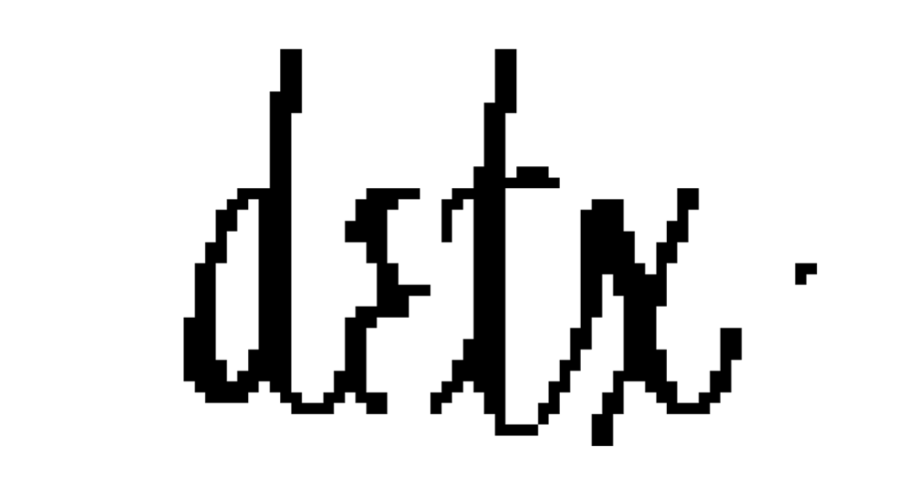
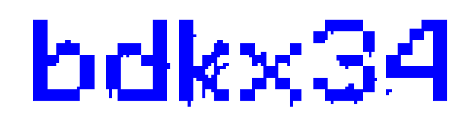
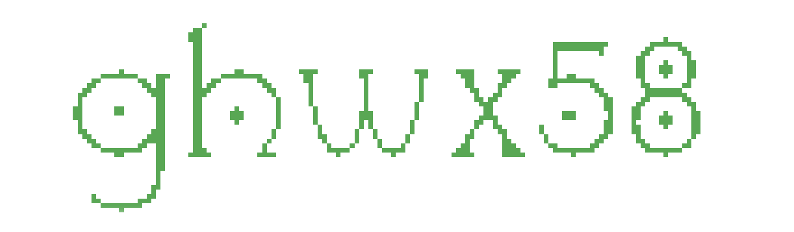
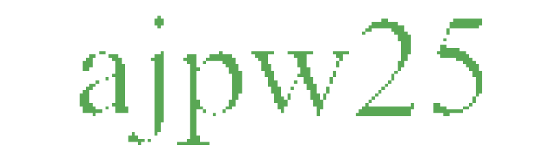

# Лабораторная работа: Обучение Tesseract для распознавания шрифтов

## Описание проекта
Проект демонстрирует процесс обучения Tesseract OCR для распознавания текста на изображениях с разными шрифтами. Реализовано:
- Предобработка изображений (удаление шумов, поворот)
- Генерация тренировочных данных для 6 шрифтов
- Обучение модели и оценка качества распознавания

## Технологический стек
- **Python 3.12**
- **Библиотеки**:
  - `pytesseract 0.3.13` - интеграция с Tesseract OCR
  - `Pillow 11.0.0` - обработка изображений
  - `prettytable 3.11.0` - форматирование вывода

### Анализ результатов
Результаты распознавания для обученной и необученной версий Tesseract представлены в таблице:

| Шрифт      | Всего изображений | Распознано (необученный) | % (необученный) | Распознано (обученный) | % (обученный) |
|------------|-------------------|--------------------------|-----------------|------------------------|---------------|
| Arial      | 6977              | 4978                     | 71.3%           | 4727                   | 67.7%         |
| Campanella | 6973              | 2                        | 0.03%           | 7                      | 0.1%          |
| Minecraft  | 6981              | 209                      | 3.0%            | 327                    | 4.7%          |
| Montesuma  | 6979              | 822                      | 11.8%           | 3602                   | 51.6%         |
| Ryuk       | 6983              | 650                      | 9.3%            | 4393                   | 62.9%         |
| Times      | 6985              | 3761                     | 53.8%           | 2758                   | 39.4%         |

## Примеры обработанных изображений
Результаты очистки CAPTCHA для каждого шрифта:

| Шрифт      | Изображение                     | Характеристики                     |
|------------|---------------------------------|------------------------------------|
| Arial      |        | Стандартный шрифт, высокая точность |
| Campanella |  | Декоративный, низкая распознаваемость |
| Minecraft  |  | Пиксельный, низкая распознаваемость |
| Montesuma  |  | Рукописный, хорошие результаты |
| Ryuk       |          | Готический, хорошие результаты     |
| Times      |        | Серьфный, стабильное распознавание |

### Заключение
В ходе работы был успешно применён инструмент Tesseract для распознавания текста на изображениях с различными шрифтами. Результаты показывают, что обучение модели значительно улучшает качество распознавания для некоторых шрифтов (например, Montesuma и Ryuk), в то время как для других (например, Campanella) требуются дополнительные доработки.
